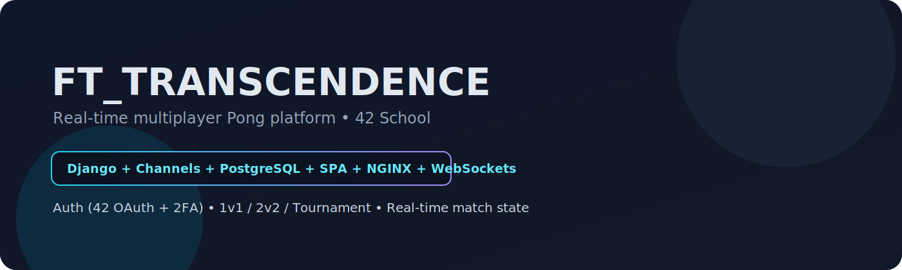
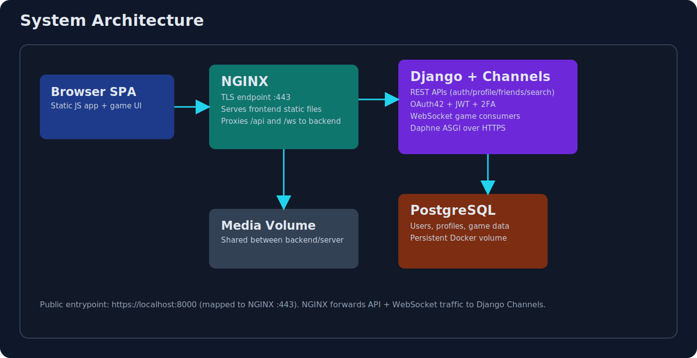
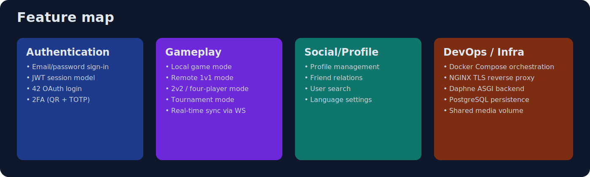
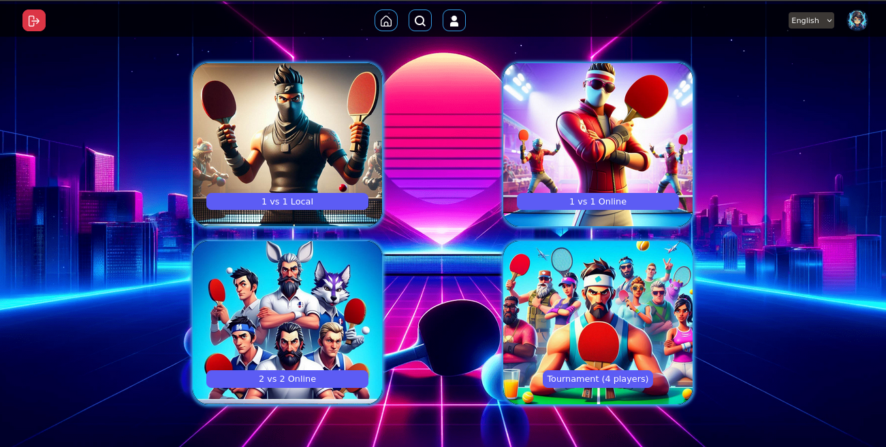
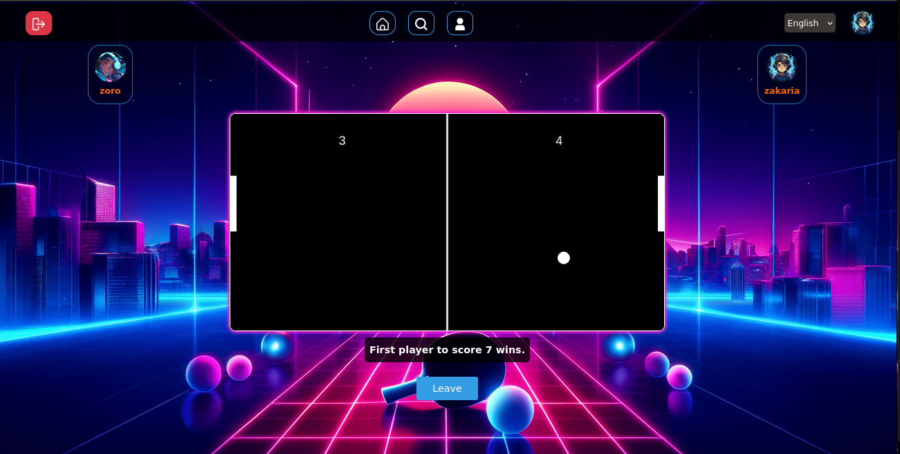
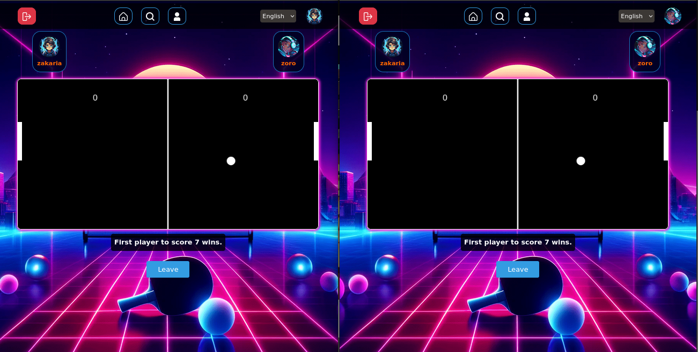
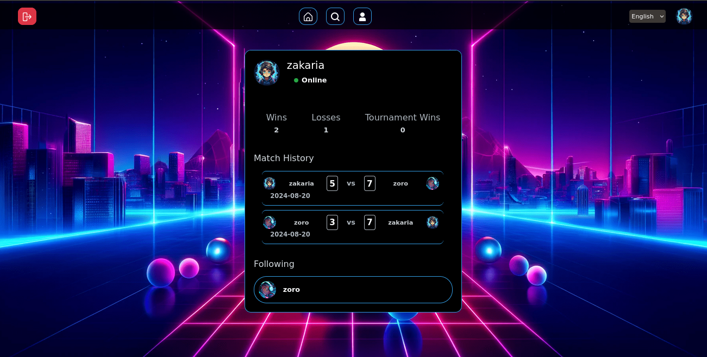

# ft_transcendence

<p align="center">
  
</p>

<p align="center">
  
  
  
  
  
</p>

`ft_transcendence` is a full-stack real-time Pong platform built as part of the 42 curriculum. It combines secure authentication, social features, and WebSocket-based multiplayer game modes in a containerized architecture.

## Portfolio Snapshot

- **Project type:** real-time web application (multiplayer Pong platform)
- **Main challenge:** synchronize gameplay state across clients with low-latency updates
- **Security scope:** JWT auth, 42 OAuth login, and optional 2FA (TOTP/QR flow)
- **Deployment style:** Docker Compose with NGINX TLS reverse proxy, Django/Channels backend, PostgreSQL
- **Team impact:** backend APIs, websocket gameplay channels, and production-like containerized integration

## Tech Stack

### Backend
- Django + Django REST Framework
- Django Channels + Daphne (ASGI)
- PostgreSQL (`psycopg2`)
- JWT (`PyJWT`), 2FA (`pyotp`, `qrcode`), bcrypt

### Frontend
- Vanilla JavaScript SPA
- Bootstrap + CSS
- WebSocket client integration for match updates

### Infrastructure
- Docker + Docker Compose
- NGINX (HTTPS termination + reverse proxy)
- Shared media volume between backend and frontend server container

## Architecture

<p align="center">
  
</p>

### Runtime flow
1. Browser requests `https://localhost:8000` (mapped to NGINX `:443`).
2. NGINX serves SPA assets from the frontend container.
3. API requests under `/api/` are proxied to Django backend.
4. WebSocket traffic under `/ws/` is upgraded and forwarded to Channels consumers.
5. Backend persists user/profile/game-related data in PostgreSQL.

## Feature Map

<p align="center">
  
</p>

### Authentication & security
- Email/password sign-in and signup endpoints.
- 42 OAuth flow (`/api/signin/auth_42_api/` + callback endpoint).
- 2FA flow (`/api/signin/twofa/`, `/api/signin/twofa_process/`, `/api/istwofa/`).
- JWT-protected identity checks (`/api/auth/`) and logout.

### Multiplayer gameplay
- WebSocket route for remote `1v1`: `/ws/onlineUser/<room>/`.
- WebSocket route for local/room testing: `/ws/pongTest/<room>/`.
- WebSocket route for `2v2`/multiple mode: `/ws/multiple/<room>/`.
- WebSocket route for tournament mode: `/ws/tournament/<room>/`.

### Social and profile features
- User profile API (`/api/profile/`, `/api/update/`, `/api/update/language/`).
- User lookup (`/api/search/`) and friend management (`/api/friends/`).
- Public user data access via user id route (`/api/userid/<id>/`).

## Project Structure

```text
ft_transcendence/
├── Backend/
│   ├── core/                   # API views, websocket consumers, routing
│   ├── ft_transcendence/       # Django settings, ASGI/WSGI config
│   ├── req.txt                 # Python dependencies
│   ├── dockerfile
│   └── script.sh               # Cert generation, migrations, Daphne startup
├── Frontend/
│   ├── nginx.conf              # TLS, SPA serving, reverse proxy config
│   └── dockerfile
├── demo_files/                 # Screenshots
├── assets/                     # README visuals
├── docker-compose.yml          # db + backend + server services
└── Makefile                    # Cleanup helpers
```

## Quick Start

### 1) Clone
```bash
git clone https://github.com/JosepharDev/ft_transcendence.git
cd ft_transcendence
```

### 2) Create `env.env`
This project expects an `env.env` file at the repository root (used by `docker-compose.yml`).

Minimum variables used by the backend settings are:

```env
SECRET_KEY=your_django_secret
UID=your_42_uid
REDIRECT_INTRA=your_42_oauth_redirect_url
INTRA_SECRET=your_42_oauth_secret

POSTGRES_DB=transcendence
POSTGRES_USER=transcendence
POSTGRES_PASSWORD=transcendence
HOST=db
PORT=5432
```

### 3) Build and run
```bash
docker compose up --build
```

### 4) Open the app
```text
https://127.0.0.1:8000
```

Your browser may warn about self-signed certificates in local development.

## Demo

### Home


### Remote match



### Profile


## Development Notes

- Backend starts through `Backend/script.sh`:
  - Generates local TLS certs for Daphne.
  - Runs migrations.
  - Launches ASGI app on `:443`.
- NGINX in `Frontend/nginx.conf` handles:
  - static SPA serving,
  - `/api/` proxy,
  - `/ws/` websocket upgrade/proxy.

## Cleanup Commands

Use the root `Makefile` targets:

```bash
make clean     # remove containers, volumes, networks
make fclean    # clean + remove images
```

## What this project demonstrates

- Building a real-time multiplayer web platform with WebSockets.
- Designing auth flows combining classic login, OAuth, and 2FA.
- Integrating frontend, backend, DB, and TLS proxy in Dockerized services.
- Structuring a project for collaborative full-stack development.